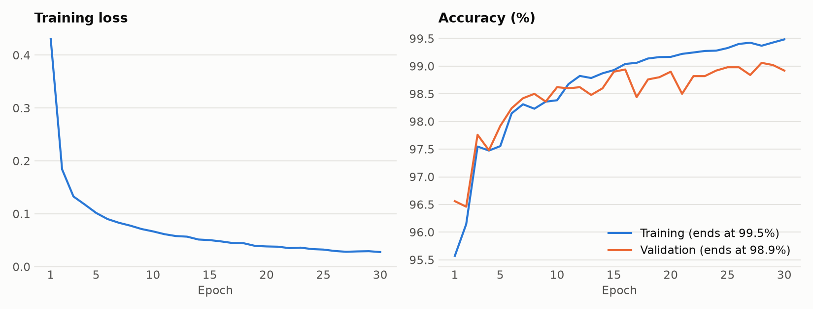
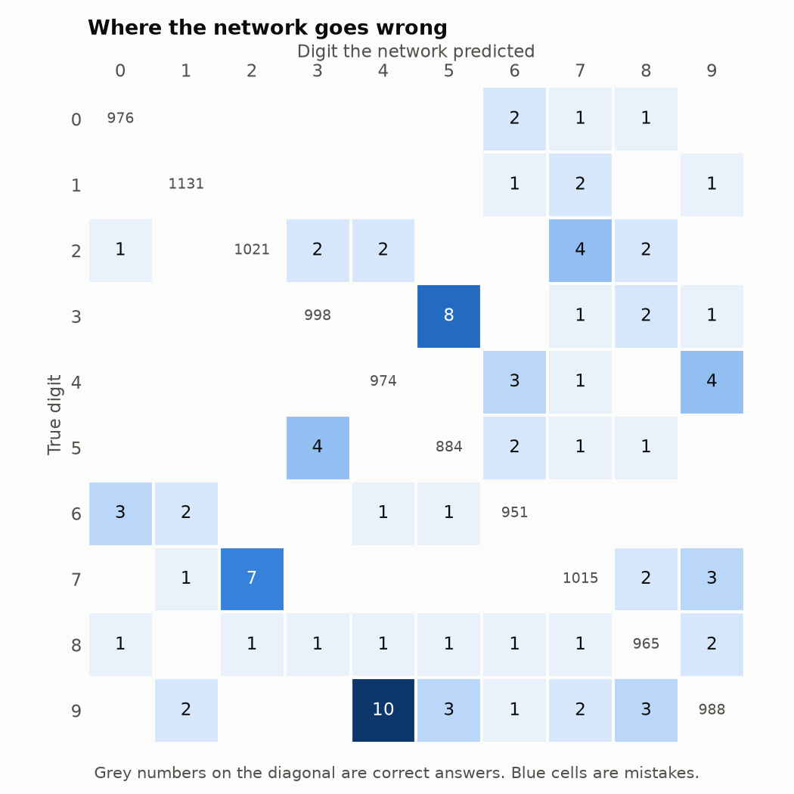
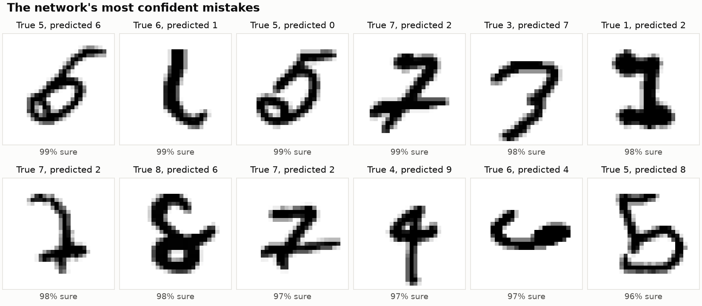

# Handwritten Digit Recogniser

[](https://github.com/aarnarathod114-lab/digit-recogniser/actions/workflows/tests.yml)


A neural network that reads handwritten digits, built from scratch with NumPy. There is no TensorFlow, PyTorch, or scikit-learn here: the forward pass, backpropagation, and training loop are all written out in plain Python.

It gets **99.03%** of 10,000 unseen test digits right.

**[Try the live demo](https://aarnarathod114-lab.github.io/digit-recogniser/)**: draw a digit and the network reads it, in your browser.

## What's in it

| | |
|---|---|
| **Built from scratch** | Forward pass, backpropagation, and gradient descent with momentum in about 120 lines of NumPy ([`network.py`](network.py)) |
| **Verified** | A gradient check compares every gradient from backpropagation against a numerical estimate. All 8 tests run automatically on every push |
| **Measured** | Each improvement was added one at a time and judged on a validation set. The test set was used only for the final number |
| **Analysed** | A confusion matrix and the most confident mistakes show where the network fails |
| **Deployed** | The trained weights run in a web page, with no server behind it |

## Results

| Version | Test accuracy | Mistakes out of 10,000 |
|---|---|---|
| Untrained network | about 10% | about 9,000 |
| First version: one hidden layer, plain gradient descent, 10 epochs | 97.46% | 254 |
| Final version: two hidden layers, momentum, learning-rate decay, shifted images, 30 epochs | **99.03%** | **97** |



Training the final version takes about two minutes on a laptop CPU.

## Which changes actually helped

The final network differs from the first in four ways, so [`experiments.py`](experiments.py) adds them one at a time and measures each. Every run uses 30 epochs and is judged on 5,000 validation images that are never used for training.

| Experiment | Training accuracy | Validation accuracy | Change |
|---|---|---|---|
| Baseline: one hidden layer of 128 | 99.93% | 98.26% | |
| + momentum | 100.00% | 98.36% | +0.10 |
| + learning-rate decay | 100.00% | 98.38% | +0.02 |
| + larger network (256, 128) | 100.00% | 98.72% | **+0.34** |
| + shifted images | 99.48% | 98.92% | **+0.20** |
| Even larger network (512, 256) | 99.65% | 98.96% | +0.04 |

What this shows:

- **The larger network and the shifted images did most of the work.** Momentum and learning-rate decay changed validation accuracy by 0.10 and 0.02 points. One validation image is worth 0.02 points, so those gains are too small to tell apart from chance.
- **Shifted images reduced overfitting.** Every earlier network reached 100% on its own training data. Sliding each batch up to 2 pixels in a random direction made memorising harder: training accuracy fell to 99.48% while validation accuracy rose.
- **Bigger stopped helping.** Doubling the network again gained 0.04 points (two images) for a longer training time, so the final network uses (256, 128).

## Where it still goes wrong



- Every digit is recognised at least 97.9% of the time. The easiest is 1 (99.65%) and the hardest is 9 (97.92%).
- The most common mistake is a 9 read as a 4 (10 times), followed by a 3 read as a 5 (8 times) and a 7 read as a 2 (7 times).
- The first version's biggest problem was a 7 read as a 9, which happened 21 times. In the final version it happens 3 times.



Some of these are hard for a person too. Others are clear to us but written in a style that is rare in the training data. The network is highly confident in all of them, which is a reminder that a confident answer is not always a correct one.

## How it works

```
784 pixels  ->  256 neurons  ->  128 neurons  ->  10 outputs
  (input)        (ReLU)           (ReLU)          (softmax)
```

The network has 235,146 numbers to learn (weights and biases). Training repeats four steps on batches of 64 images:

1. **Forward pass.** Each layer multiplies its input by a weight matrix and adds a bias. Hidden layers apply ReLU, and the last layer applies softmax to give ten probabilities.
2. **Loss.** Cross-entropy measures how far the probabilities are from the correct answer.
3. **Backpropagation.** The chain rule gives the gradient of the loss for every weight and bias, working backwards from the output.
4. **Update.** Each weight moves a small step against its gradient, with momentum.

The core of backpropagation, from [`network.py`](network.py):

```python
delta = (activations[-1] - targets) / len(targets)
for i in reversed(range(len(self.weights))):
    weight_gradients[i] = activations[i].T @ delta
    bias_gradients[i] = delta.sum(axis=0)
    if i > 0:
        delta = (delta @ self.weights[i].T) * (activations[i] > 0)
```

### Checking the maths

Backpropagation is easy to get subtly wrong, so [`tests/test_network.py`](tests/test_network.py) includes a gradient check. For every weight in a small network, it nudges the weight up and down by a tiny amount, measures how the loss changes, and compares that with the gradient from `backward()`. The two must agree to within 0.000001.

### From a drawing to a prediction

The network was trained on MNIST images, where every digit is scaled to fit a 20 × 20 box and centred by its centre of mass in a 28 × 28 grid. A digit drawn on a screen can be any size and anywhere on the canvas, so the demo prepares each drawing the same way before the network sees it. Without this step, a network that scores 99% in testing does badly on real drawings.

The live demo ([`docs/index.html`](docs/index.html)) runs only the forward pass, in JavaScript, using weights written out by [`export_weights.py`](export_weights.py). The same demo is available in Python with Gradio in [`app.py`](app.py).

## Project structure

| File | What it does |
|---|---|
| [`download_data.py`](download_data.py) | Downloads MNIST and checks the file is not corrupted |
| [`explore_data.py`](explore_data.py) | Prints a digit in the terminal |
| [`dataset.py`](dataset.py) | Loads the images, scales them to 0-1, and one-hot encodes labels |
| [`network.py`](network.py) | The neural network: forward pass, backpropagation, momentum, save and load |
| [`train.py`](train.py) | Trains the final network and saves it to `model.npz` |
| [`experiments.py`](experiments.py) | Compares training settings one change at a time |
| [`evaluate.py`](evaluate.py) | Per-digit accuracy, confusion matrix, and the charts in `images/` |
| [`app.py`](app.py) | Draw-a-digit demo in Python (Gradio) |
| [`export_weights.py`](export_weights.py) | Writes the trained weights to a file for the web page |
| [`docs/`](docs) | The live demo page |
| [`tests/`](tests) | Automated tests, including the gradient check |

## Run it yourself

You need Python 3.10 or newer.

```
git clone https://github.com/aarnarathod114-lab/digit-recogniser.git
cd digit-recogniser
python -m venv venv
venv\Scripts\activate
pip install -r requirements.txt
```

On Mac or Linux, replace the fourth line with `source venv/bin/activate`.

```
python download_data.py    # download the dataset (11 MB)
python train.py            # train the network (about 2 minutes)
python evaluate.py         # print the report and draw the charts
python -m pytest           # run the tests
python app.py              # start the demo at http://127.0.0.1:7860
```

## Limitations and next steps

- **One digit at a time.** Reading a number like 468 would need a step that first splits the image into separate digits.
- **It cannot say "I don't know".** The network always picks one of ten digits, even for a scribble or a letter.
- **It ignores the layout of the image.** A fully connected network treats each pixel as a separate input. A convolutional network, which looks at small neighbourhoods of pixels, is the standard way to get past 99% and is the natural next project.

## Acknowledgements

- The [MNIST dataset](https://en.wikipedia.org/wiki/MNIST_database) by Yann LeCun, Corinna Cortes, and Christopher Burges.
- Built as a guided learning project, with help from an AI assistant (Claude).

## Licence

[MIT](LICENSE)